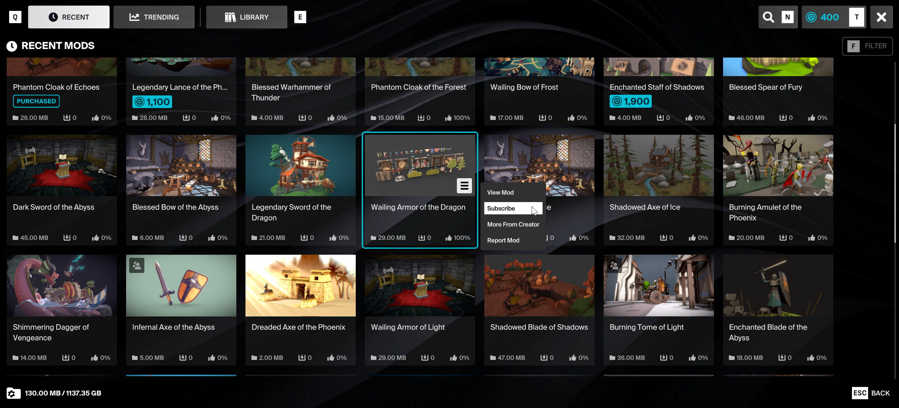
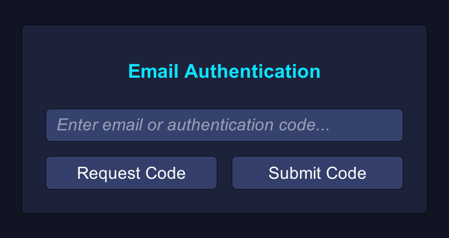
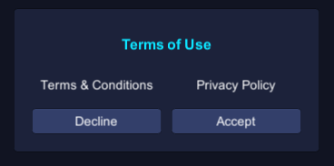
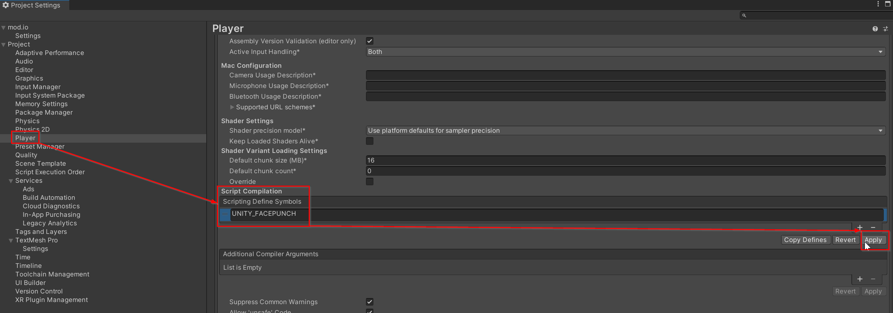
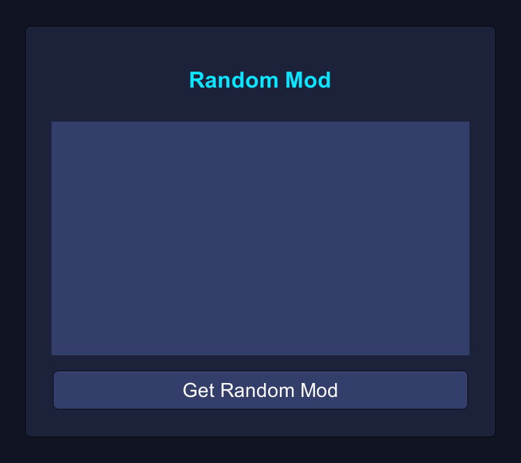

<a href="https://mod.io"></a>
# mod.io Unity Plugin v2025.10
[](https://github.com/modio/modio-unity/blob/master/Documentation/LICENSE.md)
[](https://discord.mod.io)
[](https://docs.mod.io/unity/)
[](https://unity3d.com)

> [!IMPORTANT]  
> This is a new &amp; improved version of the mod.io Unity plugin! You can find the old version (known as V2) on the [legacy-v2](https://github.com/modio/modio-unity/tree/legacy/v2) branch. This version doesn't currently have support for all platforms, you can see in [Platform Support](#platform-support) when each platform is expected to be available.

Welcome to the mod.io Unity Engine plugin [repository](https://github.com/modio/modio-unity)!

mod.io enables game developers of all sizes to integrate user-generated content directly into their games quickly and easily. This includes hosting, user profiles and subscriptions, moderation tools, file delivery, and *more*: 

- Completely cross-platform: content uploaded can be enjoyed by players on PlayStation®4, PlayStation®5, Xbox, Switch, VR and mobile
- One-click mod installs, synced to a single mod.io account across all platforms
- Independent API: integrate mod.io into your game's launcher or your homepage using our Embedded UGC Hub. It can also be used by community fan sites and Discord bots
- Founded by the [ModDB.com](https://www.moddb.com) team, with over two decades of experience in the UGC space
- Constantly evolving - we continue to work alongside our partners to iterate and improve our plugin support

The mod.io Unity Engine plugin is the simplest and fastest way to integrate UGC into your Unity **2021.3+** game. It handles all of the common tasks, allowing game developers to quickly and easily implement a solution that enables players to access and discover user-generated content for their games.

> [!NOTE]  
> A custom-built [ready-made UI](#quick-start) for mod discovery is included, along with installation and collection management, and a full-featured [C# interface](#getting-started) which connects to the [mod.io REST API](https://docs.mod.io).
>
>

## Platform Support
To access console platforms and documentation, see [Supporting Console Platforms](https://docs.mod.io/platforms/console). If a platform you require isn't available yet, please reach out to us.

| Platform          | Support |
|-------------------|:-------:|
| Windows           |    ✓    |
| macOS             |    ✓    |
| Linux             |    ✓    |
| Meta Quest        |    ✓    |
| Xbox One          |    ✓    |
| Xbox Series X     |    ✓    |
| PlayStation® 4    |    ✓    |
| PlayStation® 5    |    ✓    |
| Nintendo Switch   |    ✓    |
| iOS               |    ✓    |
| Android           |    ✓    |

## Unity Version Support
mod.io guarantees full functionality and Long-Term Support of the plugin for the following Unity Versions:

| Version | Support |
|---------|:-------:|
| 2021.3  |    ✓    |
| 2022.3  |    ✓    |
| Unity 6 |    ✓    |

## Game Studios and Publishers
If you need assistance with first-party approval, or require a private, white-label UGC solution. [Contact us](mailto:developers@mod.io)!

## Contributions Welcome
Our Unity plugin is public and open source. Game developers are welcome to utilize it as-is or fork it for their game's specific requirements.  

Want to make changes to our plugin? Submit a pull request, and we'll review your recommended changes! Our goal at [mod.io](https://mod.io) is an [open modding API](https://docs.mod.io), and you're encouraged to view, fork and contribute to [all of our codebases](https://github.com/modio)!

## Installation

> [!WARNING]  
> If you have a previous version of the plugin installed, it is _highly_ recommended to delete it before updating to a later version.

1. Install the *Newtonsoft Json* plugin using the Package Manager.
   - If your Unity Package Manager does not contain Newtonsoft Json, follow the instructions [here](https://github.com/applejag/Newtonsoft.Json-for-Unity/wiki/Install-official-via-UPM#installing-the-package-via-upm-window) to find the installation method for your Unity version.
2. Download and install the plugin using one of the following methods:
   - Using the [Unity Asset Store](https://assetstore.unity.com/packages/tools/integration/mod-browser-manager-by-mod-io-138866) and Package Manager.
   - Download the `.unitypackage` directly from the [Releases page](https://github.com/modio/modio-unity/releases).
   - Download an archive of the code using GitHub's download feature, and unpack it in your project's `Assets/Plugins` directory.
3. Restart Unity, to ensure it recognises the new assembly definitions.

> [!NOTE]  
> If you receive errors due to conflicting libraries after installing the plugin, remove any duplicates from `Assets/Plugins/Modio/ThirdParty`.

## Setup

The first thing you'll need to do is [create a game profile](https://mod.io/g/add) on mod.io (or our [private test environment](https://test.mod.io/g/add)).

> [!IMPORTANT]  
> You'll need your `Game Id`, `API key` and `API Path` for the following steps.

1. Ensure you have installed the plugin using the [installation instructions](#installation) above.
2. In Unity, select the mod.io *config file* by navigating to `Tools -> mod.io -> Edit Settings`.
3. In the Inspector, enter your `Game Id`, `API key` and `API Path` into `Server URL`.

Your setup is now complete. The following sections will guide you through getting your mod.io integration up and running quickly.

If you have any questions or need some help join our [Discord](https://discord.mod.io) server.

## Quick Start

The mod.io Unity Engine plugin comes with a prebuilt UI, a drop-in, instant solution for browsing and installing your game's mods.

If you want to skip implementing your own UI, head to the README in `/Unity/UI` section for setup and usage instructions. However, we recommend following the guide below to better understand how the plugin works.

## Getting Started

In the following section, we will walk through implementing some of the most common functions of the mod.io Unity Engine plugin. We recommend reading this step-by-step guide to ensure you understand how everything works, but you can find the resulting class for reference [here](#complete-class).

> [!NOTE]  
> The mod.io plugin was built around Asynchronous programming to ensure a smooth experience for the user by never blocking the main thread. For more information on asynchronous concepts, check out the the [docs here](https://learn.microsoft.com/en-us/dotnet/csharp/asynchronous-programming/).

### Initial Setup

First, let's create a new `MonoBehaviour` called `ModioExample.cs` that will contain all of our example functionality:

```csharp
using UnityEngine;

public class ModioExample : MonoBehaviour
{
    // TODO: Keep reading the Getting Started guide
}
```

Once you've created the above class:

1. Create a new `Scene`.
2. In that scene, create an `Empty Game Object` (name it anything you'd like).
3. Add the `ModioExample` component to your `GameObject`.
4. Save the scene.

### Initialization

> [!IMPORTANT]  
> The plugin relies on the *config file* that is configured during the [setup instructions](#setup) above. Please ensure you have completed all of those steps before proceeding.

Before the plugin can be used, it needs to be initialized for the current player. This usually only needs to happen once so let's implement Unity's `Start` method in our `ModioExample.cs` file as an async method:

```csharp
using Modio; // Add this to the top of your class

void Start()
{
    InitPlugin();
}

async Task InitPlugin()
{
    Error error = await ModioClient.Init();
    
    if (error)
    {
        Debug.LogError($"Error initializing mod.io: {error}");
        return;
    }

    Debug.Log("mod.io plugin initialized");
}
```

> [!IMPORTANT]  
> All plugin configuration should be performed during Unity's `Awake` step. Make sure you only ever bind services during `Awake`, and only ever initialize the plugin during `Start` or later.

It's worth noting the `Error` class returned. All mod.io functions you call will provide this `Error` class for detailed reporting on each function call. For convenience, `Error` is implicitly converted to a boolean, allowing you to simply check if this conversion is true to know if an error occured.

Now, return to your scene in Unity, enter Play mode and you should see the logged success message.

## Authentication

Most of the API’s functionality requires player authentication. The plugin offers a large range of SSO (single-sign on) authentication options, including Steam, Oculus, Xbox, PlayStation 4/5, and more. We strongly recommend using these options as they provide a frictionless user experience and don't require multiple steps.

For now, let's start with a simple email authentication to allow us full access. To do so we need to bind the Email Authentication service so that it's chosen as the auth service for the plugin.

The `ModioEmailAuthService` class is provided for convenience. It requires an async task or object implementing `IEmailCodePrompter`. This is to tell a UI implementation when the email authentication process is ready to accept the code.

> [!NOTE]  
> While creating the UI layout referenced below is outside the scope of this guide, there are great Unity UI tutorials available. You can, however, use the image below as a guide for the elements required to achieve the same functionality:
>
> 

With your UI created, let's add our authentication functionality: 

```csharp
using UnityEngine.UI; // Add these to the top of your class
using Modio.Users;
using Modio.Authentication;

[SerializeField] InputField authInput;
[SerializeField] Button authRequest;
[SerializeField] Button authSubmit;

// Services should be bound in the Awake event. 
// Services bound in Start aren't guaranteed to bound in time for initialization.
void Awake()
{
    // This enforces email auth to be used, a higher priority can be used if needed
    ModioServices.Bind<IModioAuthService>()
                      .FromInstance(new ModioEmailAuthService(GetAuthCode));
}

// Start method...

async Task InitPlugin()
{
    // Initialization ...

    OnInit();
}

async Task OnInit()
{
    if (User.Current.IsAuthenticated)
    {
        OnAuth();
        return;
    }
    
    // You can assign these using the Inspector if you prefer
    authRequest.clicked += async () => await Authenticate();
}
   
async Task Authenticate()
{
    Error error = await ModioClient.AuthService.Authenticate(true, authInput.text);
    
    if (error)
    {
        Debug.LogError($"Error authenticating with email: {error}");
        return;
    }
    
    OnAuth();
}

// This will be called by the ModioEmailAuthService object we constructed earlier
async Task<string> GetAuthCode()
{
    bool codeEntered = false;
    
    authSubmit.onClick.AddListener(() => codeEntered = true);
    
    while (!codeEntered)
        await Task.Yield();
    
    return authInput.text;
}
   
void OnAuth()
{
    Debug.Log($"Authenticated user: {User.Current.Profile.Username}");
}
```

> [!IMPORTANT]  
> Don't forget to assign the fields in the Inspector!

If you've implemented the above correctly, you should now be able to:

1. Start Play mode in Unity
2. Enter your email address in the input field and press the `authRequest` button
3. Retrieve the authorization code from your inbox
4. Enter the authorization code into the input field and press the `authSubmit` button
5. See the logged authentication message

> [!NOTE]  
> If there is no mod.io account associated with the provided email address, one will automatically be created.

There is something worth highlighting: if you restart Play mode, you'll see the logged authentication message again almost immediately. This is the result of two separate factors:

- The authentication service with the highest priority is the same as the one last used by the user to authenticate.
- At the beginning of `OnInit()`, we check to see if we are already authenticated, and if so move straight to `OnAuth()`.

If you change the highest priority auth service to another one, then the user won't be automatically logged in. This is to help facilitate both a silent log in and multiple users on the same device.

> [!NOTE]  
> If your email provider supports it, you can use plus-addressing to test multiple users with a single email address:
> ```
> john.smith+test1@gmail.com
> john.smith+test2@gmail.com
> john.smith+test3@gmail.com
> ```

### Steam Single Sign-On

Alternatively SSO methods with other platforms can be used to authenticate the user with mod.io. Check out our [documentation](https://docs.mod.io/restapi/introduction#authentication) to see a list of all platforms we support SSO with. For this example we're going to use Steam with the [Facepunch Steamworks library](https://wiki.facepunch.com/steamworks/).

Feel free to come back to this section later! Authentication is agnostic of the rest of this guide's behavior.

<details>

<summary><i>Click to expand</i></summary>

> [!IMPORTANT]   
> Before we can implement Single Sign-On, we need to configure Steam SSO for your game on the mod.io website. Please read our [documentation](https://docs.mod.io/platforms/steam/authentication) on how to do this before continuing with the implementation below.
>

To perform our Single Sign-On we're going to use Facepunch's Steamworks C# library to authenticate using a Steam account. Similarly to the Email authentication, we need to bind a Facepunch Auth Service:

```csharp
using Modio.Platforms.Facepunch; // Add this to the top of your class

void Awake()
{
    // Email binding...
        
    // By passing in the DeveloperOverride priority with the + 10, this will take precedence over email auth
    ModioServices.Bind<IModioAuthService>()
                 .FromInstance(new ModioFacepunchAuthService(), ModioServicePriority.DeveloperOverride + 10));    
}
```

> [!IMPORTANT]  
> This next section requires the `SteamClient` to have been initialized before executing. This is out of scope for this guide, but you can find a convenient example of how to do this in `/Unity/Examples/Steam/Facepunch/FacepunchExampl.cs`.

### Terms of Use

In order to authenticate a user with mod.io, they must agree to the mod.io Terms of Use. This differs from Email authentication as the Terms of Use is built into the email sign-up process, not requiring it in-game. This window requires links to the mod.io Terms of Use &amp; the mod.io Privacy Policy to be valid.

> [!NOTE]  
> While creating the UI layout referenced below is outside the scope of this guide, there are great Unity UI tutorials available. You can, however, use the image below as a guide for the elements required to achieve the same functionality:
>
> 

Using the above as a template, we'll want to modify the `OnInt()` method to display the Terms of Use if the highest priority auth service is Facepunch:

```csharp
async Task OnInit()
{
    // IsAuthenticated check...
    
    if (ModioClient.AuthService is ModioFacepunchAuthService)
    {
        tosContainer.SetActive(true);
        
        termsLink.onClick.AddListener(() => Application.OpenURL("https://mod.io/terms"));
        privacyLink.onClick.AddListener(() => Application.OpenURL("https://mod.io/privacy"));
        
        acceptButton.onClick.AddListener(() => Authenticate());
        denyButton.onClick.AddListener(() => tosContainer.SetActive(false));
        
        return;
    }
    
    // Attach authRequest click listener...
}
```

Lastly, we need to add a compiler directive to your project settings in order for the Facepunch library to compile. In your Project Settings, under Player and the platform you're building for, add `UNITY_FACEPUNCH` to the `Scripting Define Symbols`:



And that should be it! Log into Steam, accept the Terms of Use and you should see your Steam account authenticated with mod.io! If you've initialized your Steam client with the correct AppId then the mod.io plugin will automatically detect the currently logged in user and authenticate using that user.
</details>

## Adding Mods

> [!NOTE]  
> Among a range of other functionality, players can use the mod.io website for creating, modifying, and removing mods for your game.
>
> In this section, we're going to add mods using the plugin and API. Feel free to skip this section if you'd prefer to use the web interface.

Before we can interact with your game's mods via the API, we're going to need to create some test mods. We’ll start by adding some functionality that checks to see if your game has any mods. If it doesn't then we'll upload some using the API:

```csharp
using System.Threading.Tasks; // Add these to the top of your class
using Modio.Mods;

void OnAuth()
{
    // Authenticated ...
    
    await AddModsIfNone();
}

async Task AddModsIfNone()
{
    // This section ensures we only upload our mods once. Don't worry too much
    // about the specifics for now, we will introduce ModSearchFilters and GetMods 
    // properly later on.
    (Error error, ModioPage<Mod> page) = await Mod.GetMods(new ModSearchFilter());
    if (error)
    {
        Debug.LogError($"Error getting mods: {error}");
        return;
    }

    if (page.Data.Length != 0)
    {
        Debug.Log($"{page.Data.Length} mods found. Not adding mods");
        return;
    }

    // TODO: Keep reading the Getting Started guide
}
```

### Generating Dummy Mods

> [!NOTE]  
> This section is going to generate some dummy mods for use throughout the rest of this guide. If you already have mods or test files ready to upload, you can skip to the [uploading mods](#uploading-mods) section.

<details>

<summary><i>Click to expand</i></summary>
<br>
Let's generate a few dummy mods for you to use for testing. At a minimum, a mod requires the following:

- A name
- A summary
- A logo (image file with a minimum resolution of 512x288)
- At least one file

We'll use a third-party API to generate a logo for each of your mods, and we'll create a temporary folder and dummy file in each in your Unity project's directory:

> [!NOTE]  
> Don't worry if you don't understand the code below. Its only job is to generate our dummy mods, and it doesn't have any relation to the plugin! If you'd prefer to create your own dummy mods, skip to the [uploading mods](#uploading-mods) section!

> [!WARNING]  
> The following code is going to generate a handful of 10-100 MB files, the size of which will give us enough time to show download progress later on. Ensure you have some free space available in your project directory.

```csharp
using System.IO; // Add these to the top of your class
using UnityEngine.Networking;

// Reusing a single byte-array is a small memory-conscious
// optimization for when we are generating our dummy files.
static readonly byte[] Megabyte = new byte[1024 * 1024];
static readonly Random RandomBytes = new Random();

async Task AddModsIfNone()
{
    // Return if any mods exist ...
    
    DummyModData[] mods =
    {
        await GenerateDummyMod("Cool Weapon", "A really cool weapon.", "24466B", "FDA576", 10),
        await GenerateDummyMod("Funny Sound Pack", "You'll laugh a lot using this.", "B85675", "633E63", 50),
        await GenerateDummyMod("Klingon Language Pack", "tlhIngan Hol Dajatlh'a'?", "93681C", "FFEAD0", 1),
        await GenerateDummyMod("Ten New Missions", "Ported from the sequel to the prequel!", "FDA576", "D45B7A", 99),
    };
}

async Task<DummyModData> GenerateDummyMod(string name, string summary, string backgroundColor, string textColor, int megabytes)
{
    Debug.Log($"Writing temporary mod file: {name}");

    string path = Path.Combine(Application.dataPath, $"../_temp_dummy_mods/{name}");
    Directory.CreateDirectory(path);

    using (FileStream fs = File.OpenWrite(Path.Combine(path, $"{name}.dummy")))
    {
        for (int i = 0; i < megabytes; i++)
        {
            RandomBytes.NextBytes(Megabyte);
            await fs.WriteAsync(Megabyte, 0, Megabyte.Length);
        }
    }

    return new DummyModData(
        name,
        summary,
        await GenerateLogo(name.Replace(' ', '+'), backgroundColor, textColor),
        path
    );
}

// Uses a third-party API to generate a logo for each
// mod, adding some variety when we display them later
async Task<Texture2D> GenerateLogo(string text, string backgroundColor, string textColor)
{
    UnityWebRequest request = UnityWebRequestTexture.GetTexture($"https://placehold.co/512x288/{backgroundColor}/{textColor}.png?text={text}");
    request.SendWebRequest();

    while (!request.isDone)
        await Task.Yield();

    if (request.result != UnityWebRequest.Result.Success)
    {
        Debug.LogError($"GenerateLogo failed: {request.error}");

        return null;
    }

    return DownloadHandlerTexture.GetContent(request);
}

readonly struct DummyModData
{
    public readonly string name;
    public readonly string summary;
    public readonly Texture2D logo;
    public readonly string path;

    public DummyModData(string name, string summary, Texture2D logo, string path)
    {
        this.name = name;
        this.summary = summary;
        this.logo = logo;
        this.path = path;
    }
}
```

</details>

### Uploading Mods

Uploading mods is a relatively simple two-step process:

1. In order to upload a new mod, we need to prepare all the data with a *Mod Builder*. This builder stores and allows you to mutate all the data related to a mod, including its files.
2. We then call `Publish()` on the builder to push all changes to the mod.io API.

Let's add a method that handles both steps:

```csharp
async Task UploadMod(string name, string summary, Texture2D logo, string path)
{
    Debug.Log($"Starting upload: {name}");
    
    var builder = Mod.Create();
    
    builder.SetName(name)
           .SetSummary(summary)
           .SetLogo(logo.GetRawTextureData())
               .EditModfile()
               .SetSourceDirectoryPath(path)
               .FinishModfile();
    
    (Error error, Mod mod) = await builder.Publish();
    
    if (error)
    {
        Debug.LogError($"Error uploading mod {name}: {error}");
        return;
    }
    else
    {
        Debug.Log($"Successfully created mod {mod.Name} with Id {mod.Id}");
    }
}
```

All that's left now is to feed some mods to our brand new `UploadMod` method. After we test to see if any mods exist in `AddModsIfNone`, we will iterate our list of mods and upload them:

> [!IMPORTANT]  
> If you didn't generate dummy mods in the previous section, modify the below to suit your mod files.

```csharp
async Task AddModsIfNone()
{
    // Return if any mods exist ...
    
    DummyModData[] mods =
    {
        // ...
    };
    
    foreach (DummyModData mod in mods)
    {
        await UploadMod(mod.name, mod.summary, mod.logo, mod.path);
        // Directory.Delete(mod.path, true); // Uncomment if you generated dummy mods
    }
}
```

> [!NOTE]  
> When uploading a mod, the plugin expects a directory (for each mod) that it will compress before uploading. You do <b><u>not</u></b> need to zip your files before uploading.

That’s it! Enter Play mode now and, after authentication, the Unity console should come to life with the uploading of your mods. If you're eager, you can view the mods as soon as they're uploaded by going to your game's mod.io page and using the web interface.

## Searching for Mods

Searching for mods is a simple task — we've actually seen it already in the [adding mods](#adding-mods) section. To get a list of all<sup>1</sup> available mods you can use the `GetMods` method:

```csharp
using System; // Add this to the top of your class

async Task<Mod[]> GetAllMods()
{
    (Error error, ModioPage<Mod> page) = await Mod.GetMods(new ModSearchFilter());
    if (error)
    {
        Debug.LogError($"Error getting mods: {error}");
        return Array.Empty<Mod>();
    }

    return page.Data;
}
```

> [!IMPORTANT]  
> A *Mod* is a read-only mutable representation of the state of a mod. It will be updated by the mod.io plugin whenever new data for that mod is received. Each mod can be listened to for any changes so UI elements can be updated accordingly. In order to edit a mod, call `Edit` on the mod instance you want to modify, which will provide a `ModBuilder` class in edit mode.

If we add the above to our example class, and then head back up to our `OnAuth` method we can quickly log a list of all<sup>1</sup> of our available mods:

```csharp
using System.Linq; // Add this to the top of your class

ModProfile[] allMods;

async void OnAuth()
{
    // ...
    
    allMods = await GetAllMods();
    Debug.Log($"Available mods:\n{string.Join("\n", allMods.Select(mod => $"{mod.Name} (id: {mod.Id})"))}");
}
```

> [!NOTE]
> We write *all<sup>1</sup>* because while using the default *Mod Search Filter* settings will return all of *your* mods, this is only because you don't have many. This brings us to *Mod Search Filters*.

### Mod Search Filters

The maximum number of results returned can be set in the Mod Search Filter using its `SetPageSize()` method. However, the default value of 100 is also the limit. In order to return later results, you can use the Search Filter's `SetPageIndex()` method.

This is fairly simple in practice and is explained best with the following snippet:

```csharp
var searchFilter = new ModSearchFilter();
searchFilter.SetPageSize(10);
searchFilter.SetPageIndex(0); // Will return results 1-10
searchFilter.SetPageIndex(1); // Will return results 11-20
searchFilter.SetPageIndex(2); // Will return results 21-30

// You can also set pageIndex and pageSize using the constructor
new ModSearchFilter(0, 10); // Will return results 1-10
new ModSearchFilter(1, 10); // Will return results 11-20
new ModSearchFilter(2, 10); // Will return results 21-30
```

> [!NOTE]  
> Mod Search Filters have a number of options for filtering and ordering your results. See the [documentation](https://docs.mod.io/unity/) (or use code completion in your IDE) for its available options.
> If you're looking for more granular filtering, check out the `ModioAPI.Mods.GetModsFilter` class.

### Downloading Images

More specifically: downloading a *Mod's* images. We'll cover subscribing to and installing mods soon.

A common feature when listing mods is to display an image along with its name and summary. Metadata images such as logos, screenshots, and avatars don't require subscribing to a mod to view them, and can be downloaded separately from a mod's in-game files.

As we know, [all mods have a logo](#adding-mods). So let's write a short method that selects a random mod, downloads its logo and displays it alongside its name:

> [!NOTE]  
> Below is a screenshot of the UI we're using to utilize the method. You can use this as a guide for your own or display the result however you'd like!
>
> 

```csharp
[SerializeField] Text randomName;
[SerializeField] Image randomLogo;

async void SetRandomMod()
{
    Mod mod = allMods[UnityEngine.Random.Range(0, allMods.Length - 1)];

    randomName.text = mod.name;
    
    (Error error, Texture2D texture) = await mod.Logo.DownloadAsTexture2D(Mod.LogoResolution.X320_Y180);

    if (error)
    {
        Debug.LogError($"Error downloading {mod.Name}'s logo: {error}");
        return;
    }
    
    randomLogo.sprite = Sprite.Create(texture, new Rect(0, 0, texture.width, texture.height), Vector2.zero);
}
```

> [!WARNING]  
> The code above relies on `allMods`, which is set in the first [searching for mods](#searching-for-mods) section. **Ensure that `allMods` has been set before running this method.**

This method is downloading the smallest version of the logo, `320x180`. However, Mods have a number of sizes for each image as defined in `Mod.LogoResolution` &amp; `Mod.GalleryResolution`. See the [documentation](https://docs.mod.io/unity/cs-ref) (or use code completion in your IDE) to view available options. 

## Getting Subscribed Mods

We're going to cover mod subscriptions in what will seem like a backward way. First, we'll learn how to get a list of our subscribed mods, then we'll learn how to subscribe to a mod.

The reason we do it this way is because when a User authenticates, their subscriptions will be automatically synced with the mod.io plugin. All mods retrieved from the mod.io API will be cached and updated with the most recent data, with the User's subscriptions updated and stored in `User.Current.ModRepository`.

This makes getting Subscribed mods incredibly convenient as no requests need to be made:

```csharp
static Mod[] GetSubscribedMods() => User.Current.ModRepository.GetSubscribed().ToArray();
```

Getting the user's subscribed mods first requires they be authenticated. This will be handled automatically when a User authenticates with mod.io. In order to know when everything has finished syncing, we'll want to wait until `User.Current.IsUpdating` comes back as false:

```csharp
async void OnAuth()
{
    // ...
    
    while (User.Current.IsUpdating)
        await Task.Yield();

    Mod[] subscribedMods = GetSubscribedMods();
    Debug.Log($"Subscribed mods:\n{(subscribedMods.Length > 0 ? string.Join("\n", subscribedMods.Select(mod => $"{mod.Name} (id: {mod.Id})")) : "None")}");
}
```

> [!IMPORTANT]  
> `Sync()` will typically only be called automatically by the plugin on authentication. If you make any changes using the web interface, they won't be reflected in the mod.io plugin until this `Sync()` runs. This method is available to you under `User.Current.Sync()`. However, this is an expensive method and it's recommended it be called as little as possible.

## Subscribing to Mods

Subscribing to mods is very simple. We call the async method `mod.Subscribe()`. This method already contains checks for if you're already subscribed, short-cutting to the success result if so:

```csharp
async Task SubscribeToMod(Mod mod)
{
    var error = await mod.Subscribe();

    if (error)
    {
        Debug.LogError($"Error subscribing to {mod.Name}: {error}");
        return;
    }

    Debug.Log($"Subscribed to mod: {mod.Name}");
}
```

> [!NOTE]
> The web interface at your game's mod.io page can also be used to subscribe to mods. However, you'll need to exit and enter Play mode to see the changes, as `Sync()` needs to be run to synchronise the local state.

To test it out, in your `OnAuth()` method, after we log all subscribed mods add the following line to subscribe to a random mod:

```csharp
async void OnAuth()
{
    // ...
       
    await SubscribeToMod(allMods[UnityEngine.Random.Range(0, allMods.Length - 1)]);
}
```

Enter Play mode and you should see one of the generated mods appear in your "Subscribed mods" log!

## Installing Mods

Now, the moment we've all been waiting for. Downloading, installing, updating, and deleting mods are all handled automatically by the plugin. This behaviour can be disabled using your `ModioSettings` we configured in [Set Up](#setup).

In the following code we'll presume this has been disabled, so we can show how to activate &amp; deactivate it at will. We'll also leverage `ModInstallationManagement.MangementEvents` to see the download progress:

```csharp
Mod currentDownload;
float downloadProgress;
float timeToProgressCheck = 1f;

void WakeUpModManagement()
{
    void HandleModManagementEvent(
        Mod mod, 
        Modfile modfile, 
        ModInstallationManagement.OperationType jobType, 
        ModInstallationManagement.OperationPhase jobPhase
    ){
        Debug.Log($"{jobType} {jobPhase}: {mod.Name}");

        switch (jobPhase)
        {
            case ModInstallationManagement.OperationPhase.Started
                when jobType is not ModInstallationManagement.OperationType.Uninstall:
                currentDownload = mod;
                break;

            case ModInstallationManagement.OperationPhase.Cancelled:
            case ModInstallationManagement.OperationPhase.Failed:
                currentDownload = null;
                break;
            
            case ModInstallationManagement.OperationPhase.Completed
                when jobType is not ModInstallationManagement.OperationType.Uninstall:
                Debug.Log($"Mod {mod.Name} installed at {mod.File.InstallLocation}");
                currentDownload = null;
                break;
            
            case ModInstallationManagement.OperationPhase.Completed:
                Debug.Log($"Mod {mod.Name} uninstalled");
                break;
    }
    
    ModInstallationManagement.ManagementEvents += HandleModManagementEvent;
}

void Update()
{
    if (currentDownload == null)
        return;

    timeToProgressCheck -= Time.deltaTime;

    if (timeToProgressCheck > 0)
        return;

    Debug.Log($"Downloading {currentDownload.Name}: [{Mathf.RoundToInt(currentDownload.File.FileStateProgress * 100)}%]");
    timeToProgressCheck += 1f;
}
```

In a real implementation, you'll likely track the `modId`'s download and install progress separately to display in your UI. But, this should give you an idea of what's possible with the mod management feature.

> [!NOTE]  
> There are a number of mod management events available. See the [documentation](https://docs.mod.io/unity/cs-ref) (or use code completion in your IDE) for a complete list.

## Using Mods

We’re nearing the end now. You've [initialized](#initialization). You've [authenticated](#authentication). You've [uploaded](#adding-mods). You've [searched](#searching-for-mods). You've [subscribed](#subscribing-to-mods). You've [installed](#installing-mods). It's all led to this single question:

*"How do I find installed mods?"*

The answer is very straight forward: `mod.File.InstallLocation`. Using this is as simple as expected, in the previous method lets move `OperationPhase.Completed` to its own case and print the install location to the console:

```csharp
case ModInstallationManagement.OperationPhase.Completed:
    Debug.Log($"Mod {mod.Name} installed at {mod.File.InstallLocation}");
    break;
```

In order to get a list of all installed mods on the file system, we simply call `ModInstallationManagement.GetAllInstalledMods()`:

```csharp
async void OnAuth()
{
    // ...
       
    var installedMods = ModInstallationManagement.GetAllInstalledMods();
    Debug.Log($"Installed mods:\n{(installedMods.Count > 0 ? string.Join("\n", installedMods.Select(mod => $"{mod.Name} (id: {mod.Id})")) : "None")}");
}
```

We're currently logging each installed mod and the path to its files (`mod.File.InstallLocation`). However, *you* are only limited by how you want to utilize user-generated content. A mod's installation directory is exactly the same as when we uploaded it: uncompressed and ready for action.

One last thing to note, this will provide mods installed by *any user* on the file system. This is to facilitate offline mod management so the user doesn't ever get stuck if they're offline. Use `installedMod.IsSubscribed()` to determine if the mod is subscribed to by the current authenticated user.

And that’s it, we’re done! The time has come to build a bridge to your creator community using mod.io.

Please join us on our [Discord server](https://discord.mod.io) if you have any questions or need some help.

## Complete Class

> [!NOTE]  
> You can also find the following class (along with an example scene) in `Assets/Plugins/Modio/Unity/Example`. 

<details>

<summary><i>Click to expand</i></summary>

```csharp
using System;
using System.IO;
using System.Linq;
using System.Threading.Tasks;
using Modio;
using Modio.Authentication;
using Modio.Mods;
using Modio.Unity;
using Modio.Users;
using UnityEngine;
using UnityEngine.Networking;
using UnityEngine.UI;
using Random = System.Random;

public class ModioUnityExample : MonoBehaviour
{
    // Reusing a single byte-array is a small memory-conscious
    // optimization for when we are generating our dummy files.
    static readonly byte[] Megabyte = new byte[1024 * 1024];
    static readonly Random RandomBytes = new Random();

    [Header("Authentication")]
    [SerializeField] GameObject authContainer;
    [SerializeField] InputField authInput;
    [SerializeField] Button authRequest;
    [SerializeField] Button authSubmit;

    // Downloading images
    [Header("Random Mod")]
    [SerializeField] GameObject randomContainer;
    [SerializeField] Text randomName;
    [SerializeField] Image randomLogo;
    [SerializeField] Button randomButton;
    
    // Searching for mods
    Mod[] allMods;

    // Installing mods
    Mod currentDownload;
    float downloadProgress;
    float timeToProgressCheck = 1f;

    void Awake()
    {
        // This enforces email auth to be used, a higher priority can be used if needed
        ModioServices.Bind<IModioAuthPlatform>()
                          .FromInstance(new ModioEmailAuthPlatform(GetAuthCode));
        
        randomContainer.SetActive(false);
    }

#region Initialization

    void Start()
    {
        InitPlugin();
    }

    async Task InitPlugin()
    {
        Error error = await ModioClient.Init();

        if (error)
        {
            Debug.LogError($"Error initializing mod.io: {error}");
            return;
        }

        Debug.Log("mod.io plugin initialized");
        OnInit();
    }

    void OnInit()
    {
        if (User.Current.IsAuthenticated)
        {
            OnAuth();
            return;
        }

        // You can assign these using the Inspector if you prefer
        authRequest.onClick.AddListener(() => Authenticate());
    }

#endregion

#region Authentication

    async Task Authenticate()
    {
        Error error = await ModioClient.AuthPlatform.Authenticate(true, authInput.text);

        if (error)
        {
            Debug.LogError($"Error authenticating with email: {error}");
            return;
        }

        OnAuth();
    }

    async Task<string> GetAuthCode()
    {
        bool codeEntered = false;

        authSubmit.onClick.AddListener(() => codeEntered = true);
        
        while (!codeEntered)
            await Task.Yield();

        return authInput.text;
    }

    async void OnAuth()
    {
        Debug.Log($"Authenticated user: {User.Current.Profile.Username}");

        await AddModsIfNone();
        
        allMods = await GetAllMods();
        Debug.Log($"Available mods:\n{string.Join("\n", allMods.Select(mod => $"{mod.Name} (id: {mod.Id})"))}");
        
        randomButton.onClick.AddListener(SetRandomMod);
        randomContainer.SetActive(true);
        SetRandomMod();
        
        while (User.Current.IsUpdating)
            await Task.Yield();

        Mod[] subscribedMods = GetSubscribedMods();
        Debug.Log($"Subscribed mods:\n{(subscribedMods.Length > 0 ? string.Join("\n", subscribedMods.Select(mod => $"{mod.Name} (id: {mod.Id})")) : "None")}");

        await SubscribeToMod(allMods[UnityEngine.Random.Range(0, allMods.Length - 1)]);
        
        WakeUpModManagement();
    }

#endregion

#region Uploading Mods

    async Task AddModsIfNone()
    {
        (Error error, ModioPage<Mod> page) = await Mod.GetMods(new ModSearchFilter());
        if (error)
        {
            Debug.LogError($"Error getting mods: {error}");
            return;
        }

        if (page.Data.Length != 0)
        {
            Debug.Log($"{page.Data.Length} mods found. Not adding mods");
            return;
        }

        DummyModData[] mods =
        {
            await GenerateDummyMod("Cool Weapon", "A really cool weapon.", "24466B", "FDA576", 10),
            await GenerateDummyMod( "Funny Sound Pack", "You'll laugh a lot using this.", "B85675", "633E63", 50),
            await GenerateDummyMod("Klingon Language Pack", "tlhIngan Hol Dajatlh'a'?", "93681C", "FFEAD0", 1),
            await GenerateDummyMod( "Ten New Missions", "Ported from the sequel to the prequel!", "FDA576", "D45B7A", 99),
        };
        
        foreach (DummyModData mod in mods)
        {
            await UploadMod(mod.name, mod.summary, mod.logo, mod.path);
            // Directory.Delete(mod.path, true); // Uncomment if you generated dummy mods
        }
    }

    async Task UploadMod(string modName, string summary, Texture2D logo, string path)
    {
        Debug.Log($"Starting upload: {modName}");
    
        var builder = Mod.Create();
    
        builder.SetName(modName)
               .SetSummary(summary)
               .SetLogo(logo.GetRawTextureData())
               .EditModfile()
               .SetSourceDirectoryPath(path)
               .FinishModfile();
    
        (Error error, Mod mod) = await builder.Publish();
    
        if (error)
        {
            Debug.LogError($"Error uploading mod {modName}: {error}");
            return;
        }

        Debug.Log($"Successfully created mod {mod.Name} with Id {mod.Id}");
    }

#endregion

#region Searching for Mods

    async Task<Mod[]> GetAllMods()
    {
        (Error error, ModioPage<Mod> page) = await Mod.GetMods(new ModSearchFilter());
        if (error)
        {
            Debug.LogError($"Error getting mods: {error}");
            return Array.Empty<Mod>();
        }

        return page.Data;
    }

#endregion

#region Downloading Images

    async void SetRandomMod()
    {
        Mod mod = allMods[UnityEngine.Random.Range(0, allMods.Length - 1)];
        
        randomName.text = mod.Name;

        (Error error, Texture2D texture) = await mod.Logo.DownloadAsTexture2D(Mod.LogoResolution.X320_Y180);

        if (error)
        {
            Debug.LogError($"Error downloading {mod.Name}'s logo: {error}");
            return;
        }
        
        randomLogo.sprite = Sprite.Create(texture, new Rect(0, 0, texture.width, texture.height), Vector2.zero);
    }

#endregion

#region Subscribing to Mods

    static Mod[] GetSubscribedMods() => User.Current.ModRepository.GetSubscribed().ToArray();

    async Task SubscribeToMod(Mod mod)
    {
        var error = await mod.Subscribe();

        if (error)
        {
            Debug.LogError($"Error subscribing to {mod.Name}: {error}");
            return;
        }
        
        Debug.Log($"Subscribed to mod: {mod.Name}");
    }

#endregion

#region Installing Mods

    void WakeUpModManagement()
    {
        void HandleModManagementEvent(
            Mod mod, 
            Modfile modfile, 
            ModInstallationManagement.OperationType jobType, 
            ModInstallationManagement.OperationPhase jobPhase
        ){
            Debug.Log($"{jobType} {jobPhase}: {mod.Name}");

            switch (jobPhase)
            {
                case ModInstallationManagement.OperationPhase.Started
                    when jobType is not ModInstallationManagement.OperationType.Uninstall:
                    currentDownload = mod;
                    break;

                case ModInstallationManagement.OperationPhase.Cancelled:
                case ModInstallationManagement.OperationPhase.Failed:
                    currentDownload = null;
                    break;
                
                case ModInstallationManagement.OperationPhase.Completed
                    when jobType is not ModInstallationManagement.OperationType.Uninstall:
                    Debug.Log($"Mod {mod.Name} installed at {mod.File.InstallLocation}");
                    currentDownload = null;
                    break;
                
                case ModInstallationManagement.OperationPhase.Completed:
                    Debug.Log($"Mod {mod.Name} uninstalled");
                    break;
            }
        }
        
        ModInstallationManagement.ManagementEvents += HandleModManagementEvent;
    }

    void Update()
    {
        if (currentDownload == null)
            return;

        timeToProgressCheck -= Time.deltaTime;

        if (timeToProgressCheck > 0)
            return;

        Debug.Log($"Downloading {currentDownload.Name}: [{Mathf.RoundToInt(currentDownload.File.FileStateProgress * 100)}%]");
        timeToProgressCheck += 1f;
    }

#endregion

#region Generate Dummy Mods

    async Task<DummyModData> GenerateDummyMod(
        string dummyName,
        string summary,
        string backgroundColor,
        string textColor,
        int megabytes
    )
    {
        Debug.Log($"Writing temporary mod file: {dummyName}");

        string path = Path.Combine(Application.dataPath, $"../_temp_dummy_mods/{dummyName}");
        Directory.CreateDirectory(path);

        using (FileStream fs = File.OpenWrite(Path.Combine(path, $"{dummyName}.dummy")))
        {
            for (int i = 0; i < megabytes; i++)
            {
                RandomBytes.NextBytes(Megabyte);
                await fs.WriteAsync(Megabyte, 0, Megabyte.Length);
            }
        }

        return new DummyModData(
            dummyName,
            summary,
            await GenerateLogo(dummyName.Replace(' ', '+'), backgroundColor, textColor),
            path
        );
    }

    // Uses a third-party API to generate a logo for each
    // mod, adding some variety when we display them later
    async Task<Texture2D> GenerateLogo(string text, string backgroundColor, string textColor)
    {
        UnityWebRequest request = UnityWebRequestTexture.GetTexture(
            $"https://placehold.co/512x288/{backgroundColor}/{textColor}.png?text={text}"
        );

        request.SendWebRequest();

        while (!request.isDone)
            await Task.Yield();

        if (request.result != UnityWebRequest.Result.Success)
        {
            Debug.LogError($"GenerateLogo failed: {request.error}");

            return null;
        }

        return DownloadHandlerTexture.GetContent(request);
    }

    readonly struct DummyModData
    {
        public readonly string name;
        public readonly string summary;
        public readonly Texture2D logo;
        public readonly string path;

        public DummyModData(string name, string summary, Texture2D logo, string path)
        {
            this.name = name;
            this.summary = summary;
            this.logo = logo;
            this.path = path;
        }
    }

#endregion
}

```

</details>